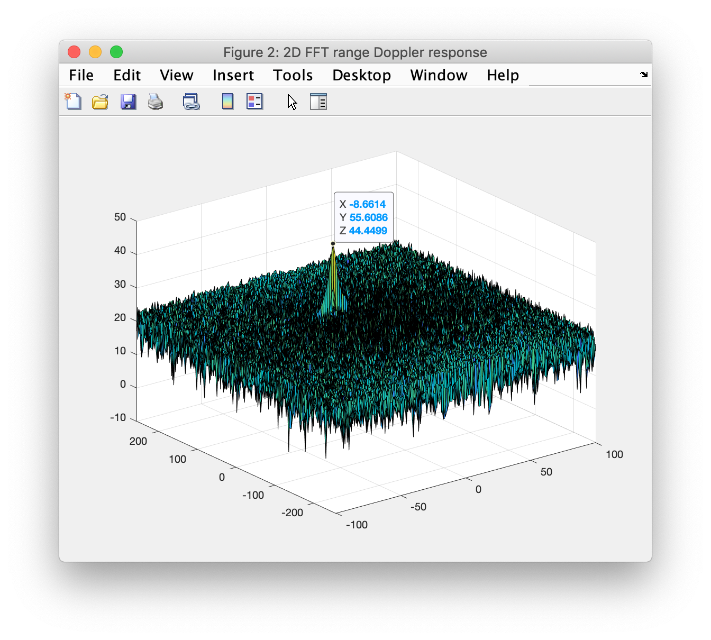
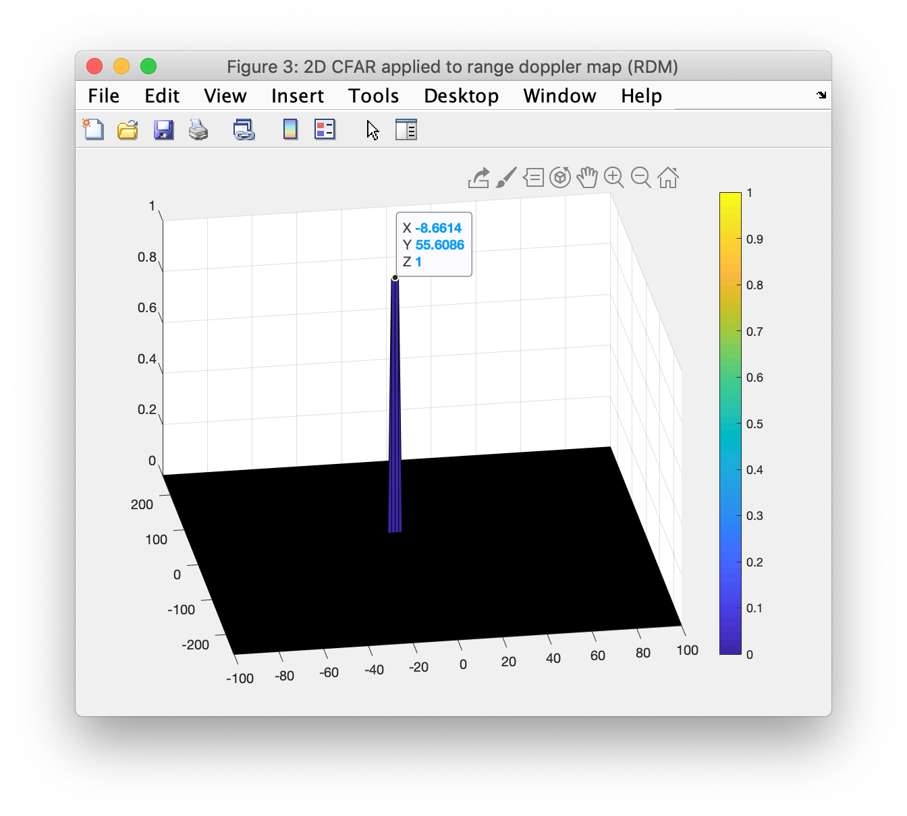

# Radar Target Generation and Detection

This project uses Matlab to introduce frequency modulated continuous-wave (FMCW) radar and related post-processing techniques. The topics covered include:
- Fast Fourier transforms (FFT) and 2D FFT
- Clutter v. target discrimination
- Sizing chirp bandwith to meet system requirements for range resolution
- Phased array beam steering to determine angle of arrival (AoA)
- Constant false alarm rate (CFAR) noise suppression
- Signal-to-noise ratio (SNR) and dynamic thresholding

## Visualization of the results

